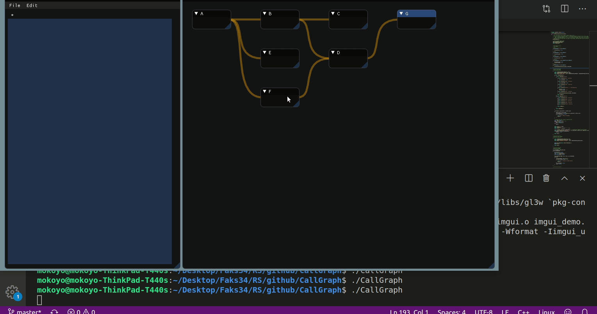

# CallGraph

## Description

Generate callgraph for your C++ code. CallGraph is implemented in C++ with [ImGui](https://github.com/ocornut/imgui).
Using [clang](https://clang.llvm.org/) for generating file with nodes and [flex](https://westes.github.io/flex/manual/) and [bison](https://www.gnu.org/software/bison/manual/) for parsing that file.
Still in development...

## Contributors:
- [Momir Adžemović](https://github.com/Robotmurlock)
- [Marko Spasić](https://github.com/spaske00)
- [Đorđe Tanasković](https://github.com/djordjetane)

## current state:
