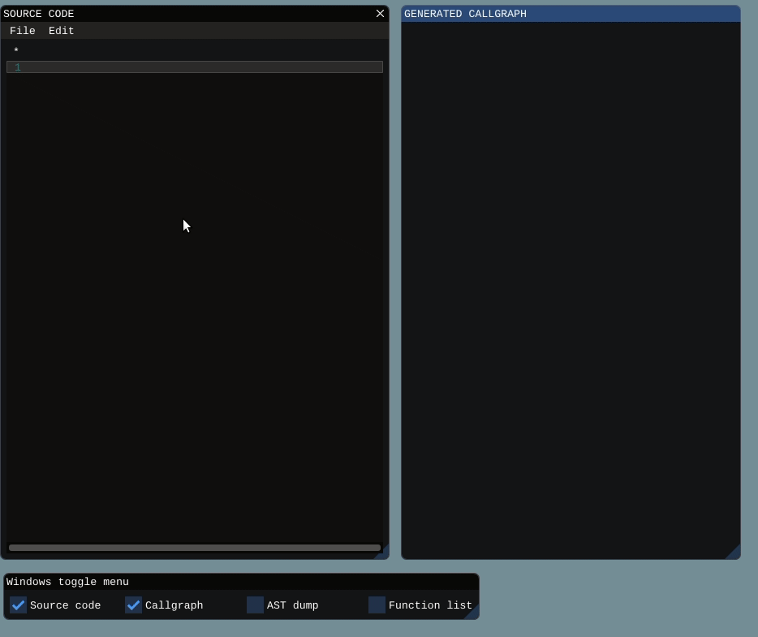
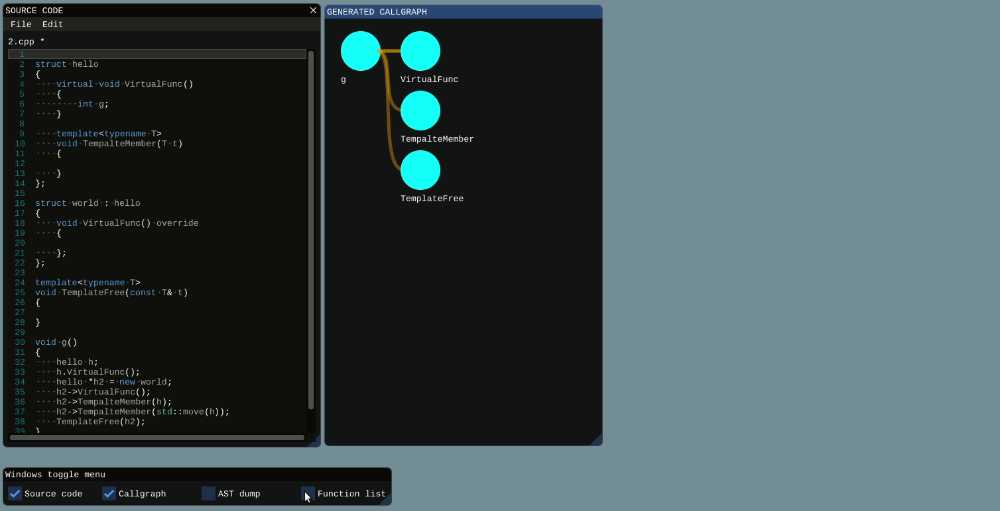
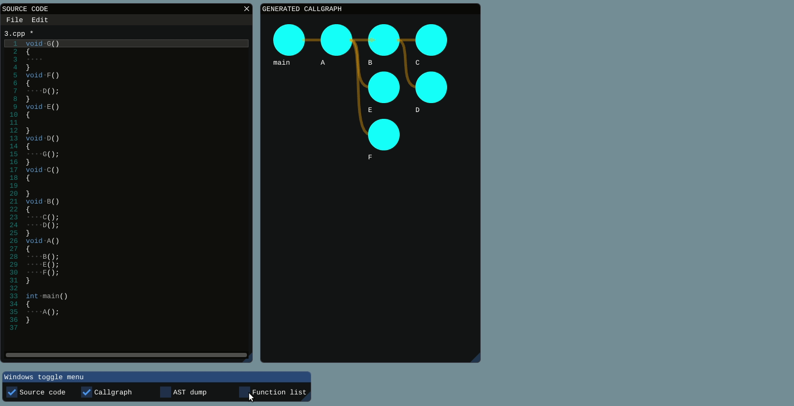
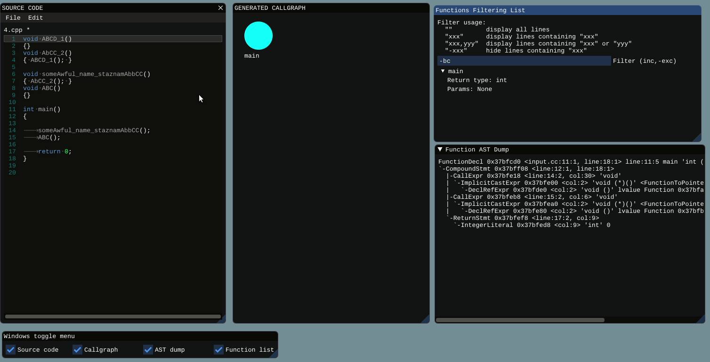

# CallGraph

## Description

Generate callgraph for your C++ code. CallGraph is implemented in C++ with [ImGui](https://github.com/ocornut/imgui) (also integrated [ImGuiColorTextEdit](https://github.com/BalazsJako/ImGuiColorTextEdit)).
Using [clang](https://clang.llvm.org/) for getting information about input source code.

## Contributors:
- [Momir Adžemović](https://github.com/Robotmurlock)
- [Marko Spasić](https://github.com/spaske00)
- [Đorđe Tanasković](https://github.com/djordjetane)

## Install libs
```
sudo apt-get update
sudo apt-get upgrade
sudo apt-get install build-essential make clang-8 libclang-8-dev llvm-8-tools libglfw3 libglfw3-dev pkg-config libglew-dev libncurses5-dev libstdc++-8-dev
```

## Build and run
```
git clone https://github.com/djordjetane/CallGraph.git
cd CallGraph
make 
./CallGraph
```

## Usage:
### 01. Open files
Find a file you want to explore and open it.


### 02. Explore the callgraph
Clicking the node draws functions that the clicked function calls.

Hovering over the node displays functions return type, name and parameters in the lower right corner of the Callgraph window.


### 03. Filter by name


### 04. Focus on some function


### 05. Reorder windows

