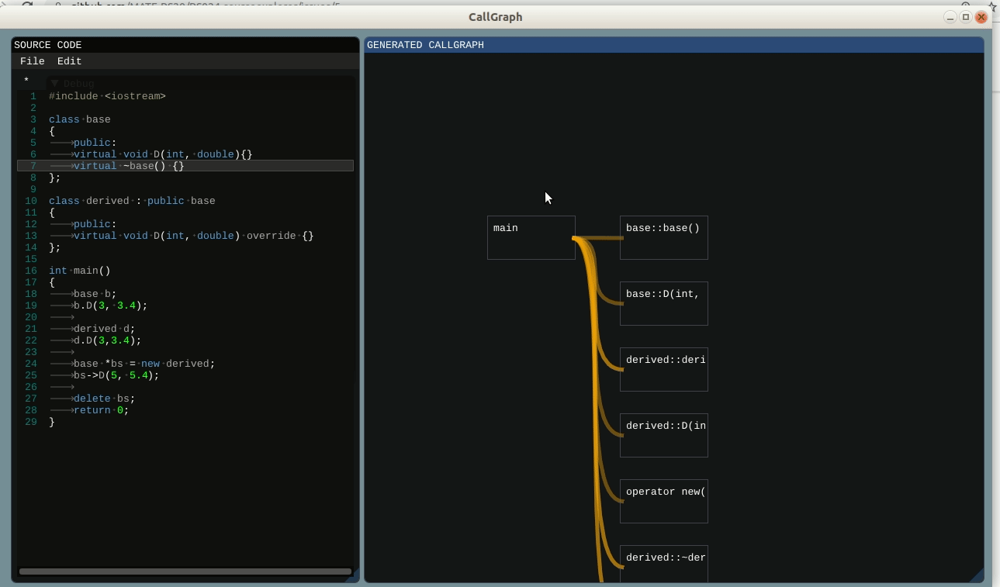

# CallGraph

## Description

Generate callgraph for your C++ code. CallGraph is implemented in C++ with [ImGui](https://github.com/ocornut/imgui) (also integrated [ImGuiColorTextEdit](https://github.com/BalazsJako/ImGuiColorTextEdit)).
Using [clang](https://clang.llvm.org/) for getting information about input source code.
Still in development...

## Contributors:
- [Momir Adžemović](https://github.com/Robotmurlock)
- [Marko Spasić](https://github.com/spaske00)
- [Đorđe Tanasković](https://github.com/djordjetane)

## Install
sudo apt-get update
sudo apt-get upgrade
sudo apt-get install build-essential make clang-8 libclang-8-dev llvm-8-tools libglfw3 libglfw3-dev pkg-config
libglew-dev libncurses5-dev

## current state:

